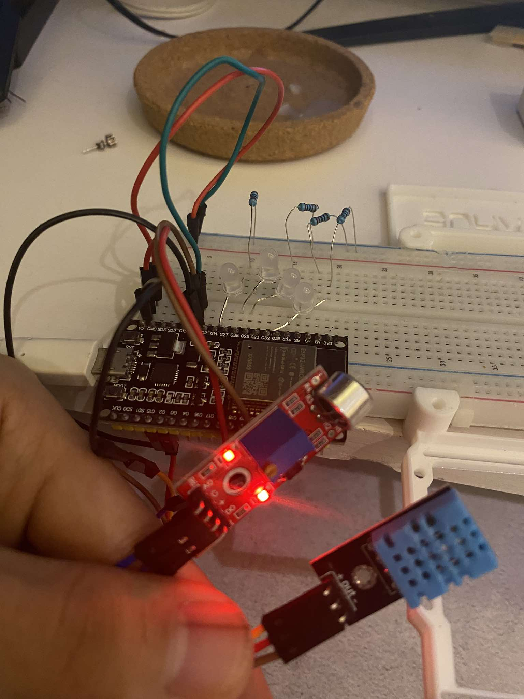
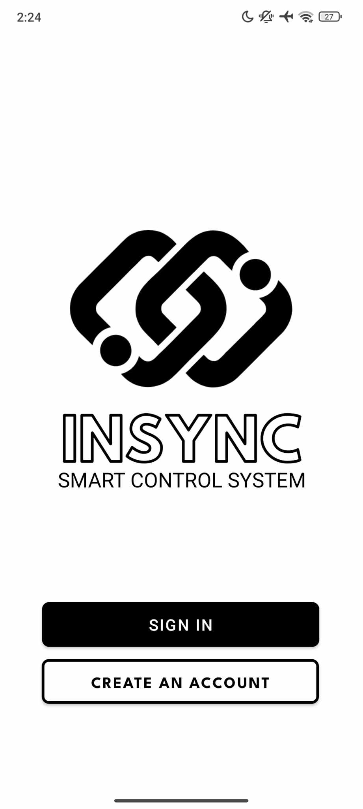
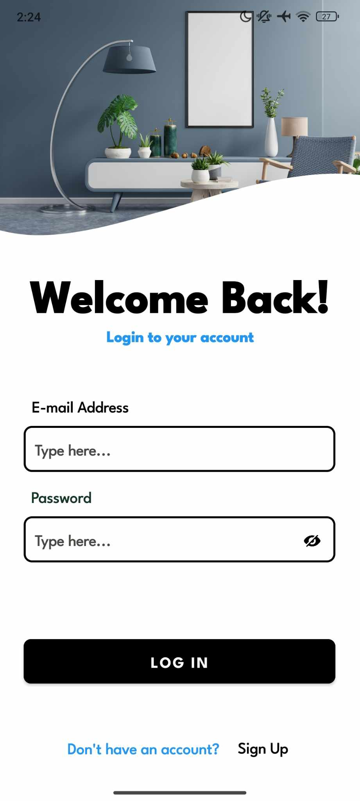
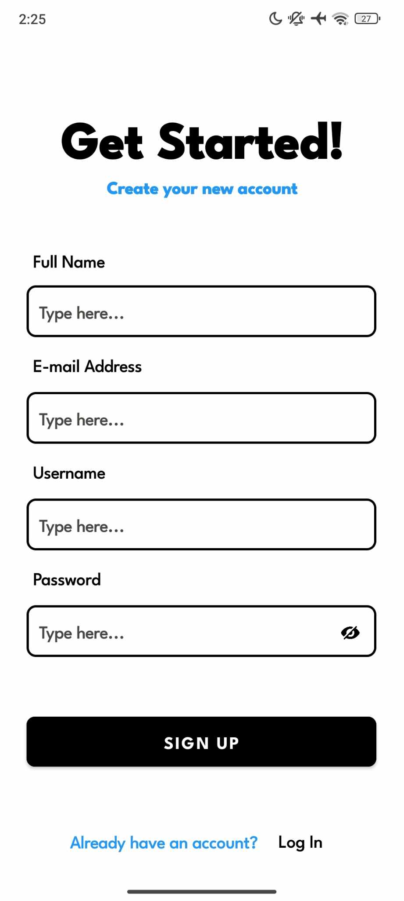
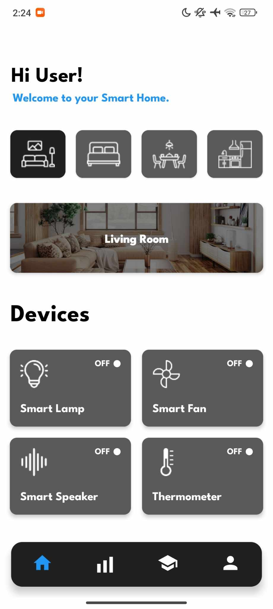
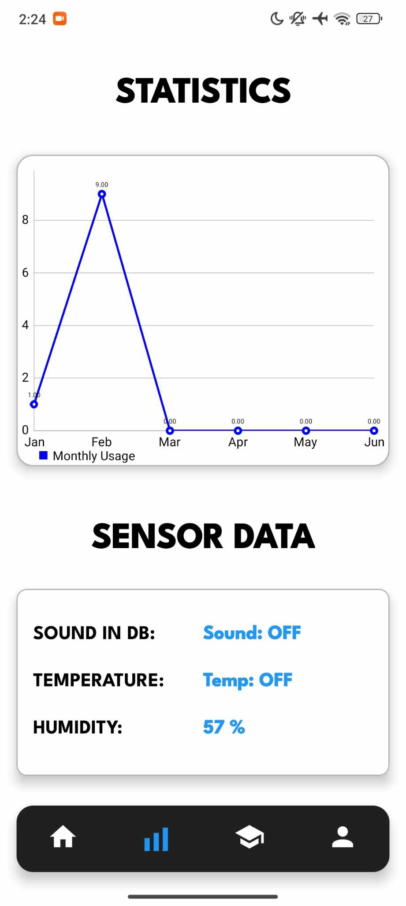
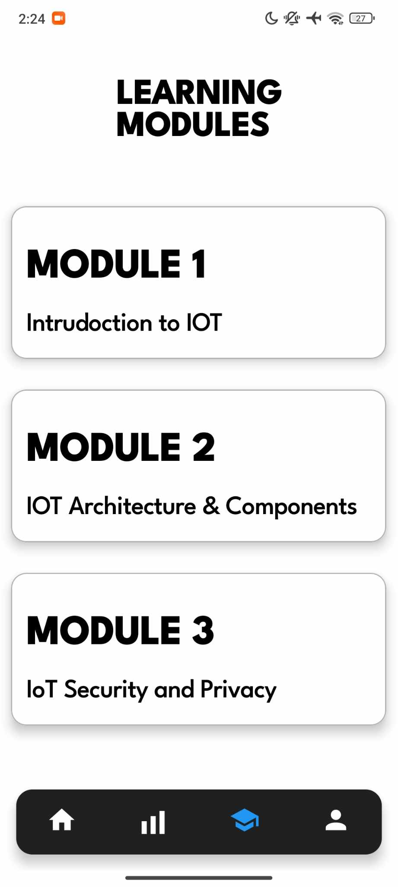
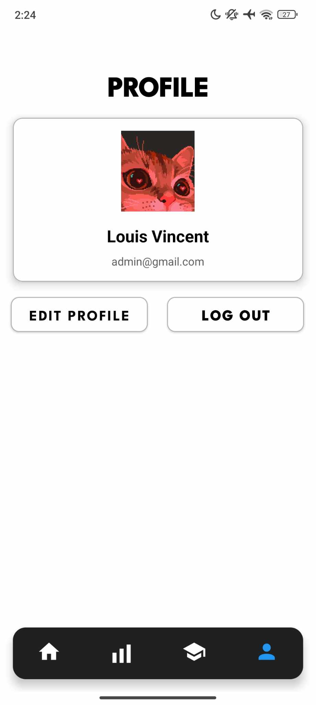

  

<h1 align="center">InSync - Smart-Control-System</h1>

  <strong>InSync - Smart Control System</strong> is a comprehensive platform designed to give users seamless control over their smart home devices through a web interface and mobile application. It enables real-time monitoring and management of a variety of devices, including lights, door locks, air quality monitors, and climate controls. With a focus on intuitive design and ease of use, InSync offers customizable automation, efficient data handling, and a fully responsive interface. The result is an integrated smart home experience that adapts to the user's needs, making home automation simple, convenient, and effective.

## Table of Contents
1.  [About the Project](#about-the-project)
2.  [Key Features](#key-features)
4.  [Usage](#usage)
5.  [Technologies Used](#technologies-used)
6.  [Screenshots](#screenshots)
7.  [Contributing](#contributing)
9.  [About The Developers](#about-the-developers)

## About the Project
**InSync - Smart Control System** is a user-friendly platform that enables seamless management of smart home devices through a web interface and an mobile application. It allows users to monitor and control various devices like lighting, fans, sound and air quality sensors. With a focus on intuitive design, real-time device control, and responsive automation, InSync simplifies the integration and management of smart home systems, offering a streamlined user experience.

## Key Features

### Smart Device Control
- **Comprehensive Room Management**
  - Room-specific device control
  - Customizable room settings
  - Intuitive interface for each space

- **Device Integration**
  - Smart lighting control
  - Temperature and humidity monitoring
  - Sound system management
  - Real-time sensor data

### User Experience
- **Intuitive Dashboard**
  - Clean, modern interface
  - Easy navigation between rooms
  - Quick access to essential controls

- **Real-time Monitoring**
  - Live temperature readings
  - Humidity level tracking
  - Sound level monitoring
  - Instant device status updates

### Security & Authentication
- **Secure User Access**
  - Email-based authentication
  - Password recovery system
  - Profile management
  - Secure data storage

### Data & Analytics
- **Performance Tracking**
  - Device usage statistics
  - Energy consumption monitoring
  - Historical data analysis
  - System performance metrics

### Educational Content
- **Learning Resources**
  - Introduction to IoT
  - IoT Architecture and its Components
  - IoT Security and Privacy

## Usage

### Getting Started
1. **User Authentication**
   - Create a new account or log in with existing credentials
   - Set up your profile and preferences
   - Reset password if needed through the forgot password feature

### Dashboard Navigation
1. **Room Selection**
   - Navigate between different rooms (Living Room, Bedroom, Kitchen)
   - View room-specific devices and controls
   - Real-time status updates for each room

2. **Device Control**
   - **Smart Lighting**
     - Toggle lights on/off
     - View current status
   - **Temperature Control**
     - Monitor real-time temperature readings
     - View humidity levels
   - **Sound System**
     - Control audio devices
     - Adjust volume settings
   - **Sensor Monitoring**
     - Track environmental data
     - View sensor statistics

### Additional Features
1. **Analytics**
   - View device usage statistics
   - Monitor energy consumption
   - Track system performance

2. **Profile Management**
   - Update user information
   - Customize app settings
   - Manage notification preferences

3. **Learning Resources**
   - Access educational content

### Getting Started
1. **User Authentication**
   - Create a new account or log in with existing credentials
   - Set up your profile and preferences
   - Reset password if needed through the forgot password feature

### Dashboard Navigation
1. **Room Selection**
   - Navigate between different rooms (Living Room, Bedroom, Kitchen)
   - View room-specific devices and controls
   - Real-time status updates for each room

2. **Device Control**
   - **Smart Lighting**
     - Toggle lights on/off
     - View current status
   - **Temperature Control**
     - Monitor real-time temperature readings
     - View humidity levels
   - **Sound System**
     - Control audio devices
     - Adjust volume settings
   - **Sensor Monitoring**
     - Track environmental data
     - View sensor statistics

### Additional Features
1. **Analytics**
   - View device usage statistics
   - Monitor energy consumption
   - Track system performance

2. **Profile Management**
   - Update user information
   - Customize app settings
   - Manage notification preferences

3. **Learning Resources**
   - Access educational content
   - View system documentation
   - Explore feature tutorials
     
## Technologies Used

### Mobile Application Development
- **Android Studio** - Primary IDE for Android app development
- **Java** - Main programming language
- **XML** - UI layout design
- **Material Design Components** (v1.11.0) - Modern UI components
- **AndroidX** 
  - AppCompat (v1.6.1)
  - ConstraintLayout (v2.1.4)
  - Activity (v1.8.2)

### Backend Services
- **Firebase**
  - Authentication (v22.3.0) - User management
  - Cloud Firestore (v24.10.0) - Database
  - Realtime Database (v20.3.0) - Real-time data
  - Cloud Storage (v20.3.0) - File storage

### Hardware & IoT
- **Arduino** - Microcontroller for hardware integration
  - Arduino IDE
  - Sensors and actuators
  - WiFi connectivity

### Data Visualization
- **MPAndroidChart** (v3.1.0) - Charts and graphs
- **Glide** (v4.12.0) - Image loading and caching

### Design Tools
- **Figma** - UI/UX design and prototyping
  - Wireframing
  - Interactive prototyping
  - Design system management
- **Canva** - Graphics and presentation design

### Version Control
- **Git** - Version control system
- **GitHub** - Repository hosting
## Screenshots
<table>
  <tr>
    <td align="center" width="33%">
       
      <em>Device</em>
    </td>
    <td align="center" width="33%">
       
      <em>Landing Page</em>
    </td>
    <td align="center" width="33%">
       
      <em>Log In Page</em>
    </td>
    <td align="center" width="33%">
       
      <em>Sign Up Page</em>
    </td>
  </tr>
  <tr>
    <td align="center" width="33%">
       
      <em>Dashboard</em>
    </td>
    <td align="center" width="33%">
       
      <em>Statistics</em>
    </td>
    <td align="center" width="33%">
       
      <em>Profile</em>
    </td>
  </tr>
  <tr>
    <td align="center" colspan="3">
       
      <em>Profile</em>
    </td>
  </tr>
</table>

## Contributing

We welcome contributions to **InSync - Smart Control System**! Whether you’re fixing bugs, suggesting features, or improving documentation, your contributions are highly valued.

### How to Contribute:
1. **Fork the Repository**: Fork the project to your GitHub account.
2. **Clone Your Fork**: Clone it to your local machine.
3. **Create a Branch**: Create a new branch for your changes.
4. **Make Changes**: Make and commit your changes.
5. **Push Changes**: Push your branch to your fork.
6. **Open a Pull Request**: Submit a pull request with a detailed description of your changes.

### Code of Conduct

We expect all contributors to **InSync - Smart Control System** to follow our Code of Conduct. By participating in this project, you agree to uphold the standards and principles set forth by the **Contributor Covenant**, which is designed to foster a positive, respectful, and collaborative environment.

Please read and adhere to the [Contributor Covenant Code of Conduct](https://www.contributor-covenant.org/version/2/0/code_of_conduct.html) to ensure a welcoming and inclusive atmosphere for everyone involved. Be kind, respectful, and considerate of all contributors.

### Issues

If you encounter any bugs or have suggestions for new features, we encourage you to open an issue on our [Issues page](https://github.com/LudwigWei/InSync---Smart-Control-System/issues). Reporting issues helps us track enhancements, address bugs efficiently, and improve the project for everyone.

Your feedback is invaluable in making **InSync - Smart Control System** better, so please don’t hesitate to share any problems or ideas you may have.

Thank you for contributing to the success of **InSync**!

## About The Developers

### 👥 Meet Our Team

<table align="center" style="margin: 0 auto;">
<tr>
<td align="center" width="280px">
 
<b>Louis Vincent A. Crisaldo</b> 
Project Manager  

</td>

<td align="center" width="280px">
 
<b>Zedric Edward C. Hernandez</b> 
Project Manager  

</td>
</tr>

<tr>
<td align="center" width="280px">
 
<b>Christian Kriel M. Quejada</b> 
Frontend Developer  

</td>

<td align="center" width="280px">
 
<b>Jeroein Lloyd P. Magno</b> 
Backend Developer  

</td>
</tr>

<tr>
<td align="center" colspan="2">
<table align="center">
<tr>
<td width="280px" align="center">
<h4>Project Management</h4>
• Team coordination 
• Resource allocation 
• Timeline management
</td>
<td width="280px" align="center">
<h4>Project Strategy</h4>
• Technical planning 
• Quality assurance 
• Team leadership
</td>
</tr>
<tr>
<td width="280px" align="center">
<h4>Frontend Development</h4>
• UI/UX design 
• Interface implementation 
• User experience
</td>
<td width="280px" align="center">
<h4>Backend Development</h4>
• Server management 
• Database design 
• API integration
</td>
</tr>
</table>
</td>
</tr>
</table>

